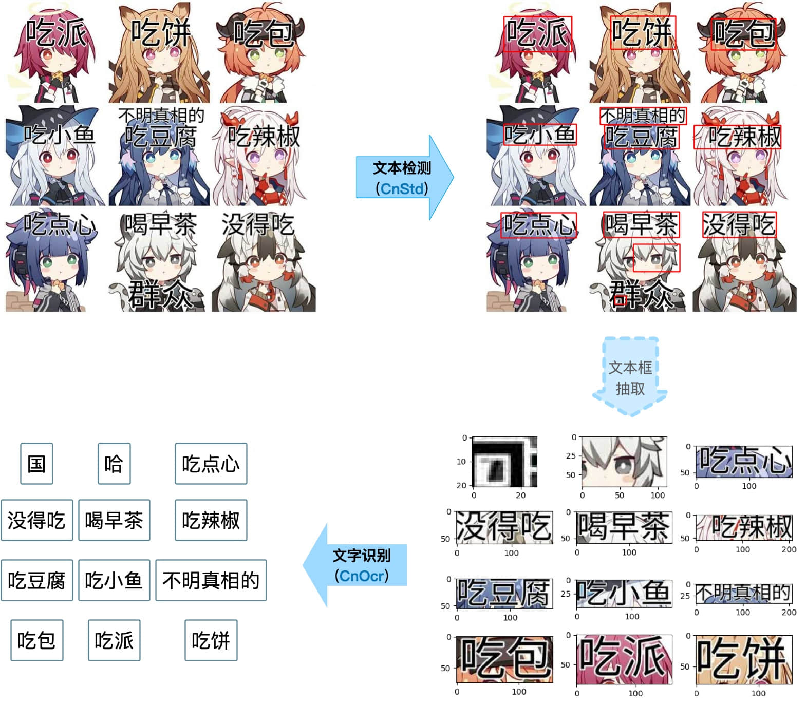

# 场景文字识别技术介绍

为了识别一张图片中的文字，通常包含两个步骤：

1. **文本检测**：检测出图片中文字所在的位置；
2. **文字识别**：识别包含文字的图片局部，预测具体的文字。

如下图：

更多相关介绍可参考作者分享：**文本检测与识别**（[PPT](intro-cnstd-cnocr.pdf)、[B站视频](https://www.bilibili.com/video/BV1uU4y1N7Ba)）。

---

cnocr 主要功能是上面的第二步，也即文字识别。有些应用场景（如下图的文字截图图片等），待检测的图片背景很简单，如白色或其他纯色，
cnocr 内置的文字检测和分行模块可以处理这种简单场景。

但如果用于其他复杂的场景文字图片（如下图）的识别，
cnocr 需要结合其他的场景文字检测引擎使用，推荐文字检测引擎 **[CnStd](https://github.com/breezedeus/cnstd)** 。

具体使用方式，可参考 [文本检测CnStd + 文字识别CnOcr](cnstd_cnocr.md)。

